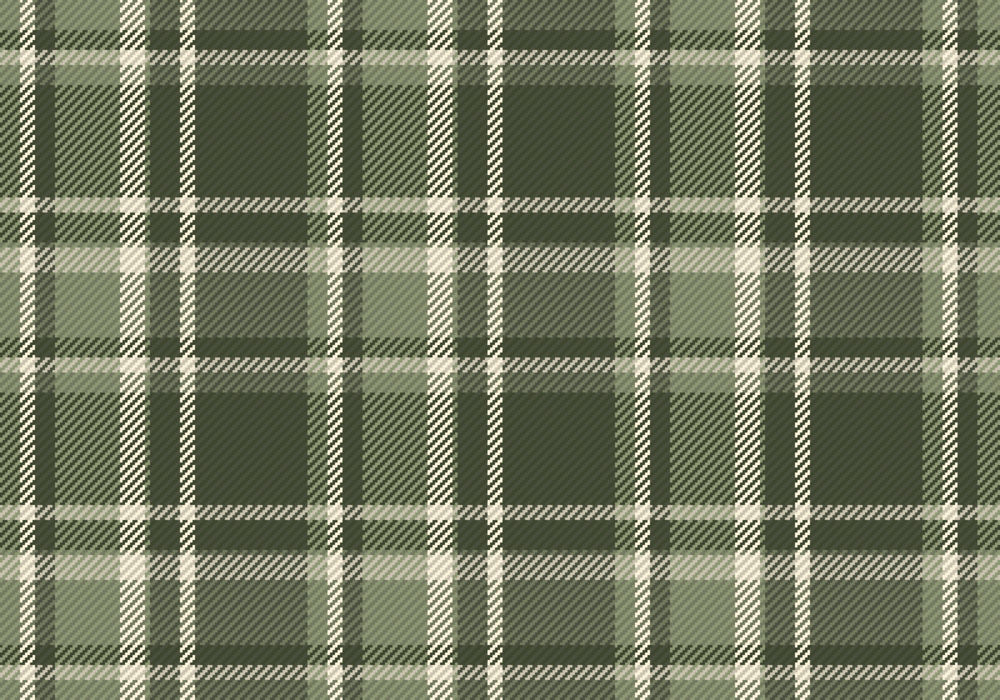

# Shaders

## Procedural Texturing


Este trabajo se realizó sacando como base la información expuesta en [The book of shaders](https://thebookofshaders.com/09/).
La idea de este ejercicio es mostrar cómo se puede aplicar una textura a un cuerpo (en este caso un cilindro) con shaders.

Lo interesante es que se puede *jugar* con un **patrón** para *rellenar* el objeto y esto genera texturas muy interesantes.





```js

let pg;
let truchetShader;
let img;
let lastMouse = 0;

path = '/VisualComputing/sketches/workshop3/ProceduralTexturing'

function preload() {
  // shader adapted from here: https://thebookofshaders.com/09/
  truchetShader = readShader(path+'/truchet.frag',
                             { matrices: Tree.NONE, varyings: Tree.NONE });

  img = loadImage(path+'/img/scotish.jpg');
}

function setup() {
  createCanvas(400, 400, WEBGL);
  // create frame buffer object to render the procedural texture
  pg = createGraphics(400, 400, WEBGL);
  textureMode(NORMAL);
  noStroke();
  pg.noStroke();
  pg.textureMode(NORMAL);
  // use truchetShader to render onto pg
  pg.shader(truchetShader);
  // emitResolution, see:
  // https://github.com/VisualComputing/p5.treegl#macros
  pg.emitResolution(truchetShader);
  // https://p5js.org/reference/#/p5.Shader/setUniform
  truchetShader.setUniform('u_zoom', 3);
  truchetShader.setUniform('texture', img);

  // pg clip-space quad (i.e., both x and y vertex coordinates ∈ [-1..1])
  pg.quad(-1, -1, 1, -1, 1, 1, -1, 1);
  // set pg as texture

  scotish = createCheckbox('scotish', false);
  scotish.position(10, 10);
  scotish.style('color', 'white');  
}

function draw() {
  background(33);
  orbitControl();
  cylinder(100, 200);
  if(scotish.checked()){
    texture(img);
  }
  else{
    texture(pg);
    lastMouse = abs(mouseX-lastMouse)
    truchetShader.setUniform('u_mouse', int(mouseX)/2000);

  }
}

function mouseMoved() {
  // https://p5js.org/reference/#/p5.Shader/setUniform
  //truchetShader.setUniform('u_zoom', int(map(mouseX, 0, width, 1, 30)));
  
  //truchetShader.setUniform('u_mouse', mouseX/2000);
  // pg clip-space quad (i.e., both x and y vertex coordinates ∈ [-1..1])
  pg.quad(-1, -1, 1, -1, 1, 1, -1, 1);
}

```




```js

// Author @patriciogv ( patricio.io ) - 2015
// Title: Nina Warmerdam ( www.behance.net/ninawarmerdam )

#ifdef GL_ES
precision mediump float;
#endif

uniform vec2 u_resolution;
uniform float u_mouse;
uniform float u_time;

vec2 tile(vec2 st, float zoom){
    st *= zoom;
    return fract(st);
}

float circle(vec2 st, float radius){
    vec2 pos = vec2(0.5)-st;
    radius *= 0.75;
    return 1.-smoothstep(radius-(radius*0.05),radius+(radius*0.05),dot(pos,pos)*3.14);
}

float circlePattern(vec2 st, float radius) {
    return  circle(st+vec2(0.,-.5), radius)+
            circle(st+vec2(0.,.5), radius)+
            circle(st+vec2(-.5,0.), radius)+
            circle(st+vec2(.5,0.), radius);
}

void main(){
    vec2 st = gl_FragCoord.xy/u_resolution.xy;
    st.x *= u_resolution.x/u_resolution.y;
    vec3 color = vec3(0.0);

    vec2 grid1 = tile(st,1.);
    grid1 = tile(st + vec2(cos(u_mouse),sin(u_mouse))*0.01,7.);
    color += mix(vec3(0.075,0.114,0.329),vec3(0.973,0.843,0.675),circlePattern(grid1,u_mouse+0.12)-circlePattern(grid1,u_mouse));

    vec2 grid2 = tile(st,3.);
    grid2 = tile(st + vec2(cos(u_mouse),sin(u_mouse))*0.02 ,3.);
    color = mix(color, vec3(0.761,0.247,0.102), circlePattern(grid2,u_mouse+0.15)) - circlePattern(grid2,u_mouse),

    gl_FragColor = vec4(color,1.0);
}

```





## Bibliografía

- [Visual Computing Course Page](https://visualcomputing.github.io/)
